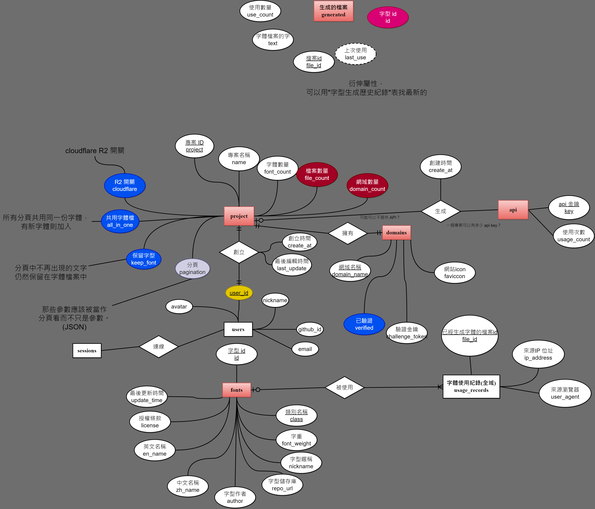

# What is this?
This folder storge some design image like database ERD etx.

> How can edit ERD or other image *.drawio.png?
Install vscode plugin [Draw.io Integration](https://marketplace.visualstudio.com/items?itemName=hediet.vscode-drawio) that you can draw it in VsCode directly

## Database ER model preview
